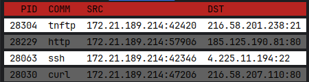

<div align="center">
    <h1>K-Ray</h1>
    <i>A simple CLI tool for monitoring linux processes' outbound network connections via eBPF</i>
</div>

# About the project

CLI tool that uses eBPF to monitor network activity of processes on a linux systems, specifically the PID | name | source address | remote address format. There are two KProbes on tcp_v4_connect function, specifically on the call itself and the return. The tool is written in Go while the small kernel part is written in C. 

# Stack

- Go (stdlib, go-pretty, cilium/ebpf)
- C
- eBPF

# Demo



# Installation

```bash
curl -LO https://github.com/Warl0rdd/k-ray/releases/latest/download/k-ray-linux-amd64
chmod +x k-ray-linux-amd64
sudo ./k-ray-linux-amd64
```

Optional: install globally

```bash
sudo mv k-ray-linux-amd64 /usr/local/bin/k-ray
sudo k-ray
```

Important: when running the tool, root access is needed as eBPF is used

# Building from source

If you want to compile **k-ray** yourself or contribute to the project, you'll need to set up the build environment. The compilation happens in two stages: compiling the eBPF C code into Go bindings, and then building the Go application.

### Prerequisites

You need Go (v1.26+ recommended) and the standard eBPF toolchain. On Ubuntu/Debian, install the required packages:

```bash
sudo apt update
sudo apt install clang llvm bpftool
```

(Note for WSL users: standard bpftool wrapper might fail, building it directly from source might be necessary. See [the official repositopry](https://github.com/libbpf/bpftool) for instructions.)

### Build steps

1. Clone the repository

```bash
git clone https://github.com/Warl0rdd/k-ray.git
cd k-ray
```

2. Generate kernel headers (vmlinux.h)

   Since kernel structs vary between versions, you need to dump the BTF (BPF Type Format) data from your currently running kernel into a C header file. Navigate to the bpf directory and generate it:

```bash
cd bpf
bpftool btf dump file /sys/kernel/btf/vmlinux format c > vmlinux.h
cd ..
```

3. Download Go dependencies:

```bash
go mod tidy
```

4. Generate eBPF Go bindings

    This command triggers bpf2go, which reads bpf/tracer.c, compiles it using Clang/LLVM, and generates the necessary Go wrappers (.go and .o files):

```bash
go generate ./...
```

Note: if you use the arm64 or any other architecture, you will need to slightly alter internal/ebpf/gen.go file (note that testing was conducted only on amd64).

5. Build and run

```bash
go build -o k-ray .
sudo ./k-ray
```
